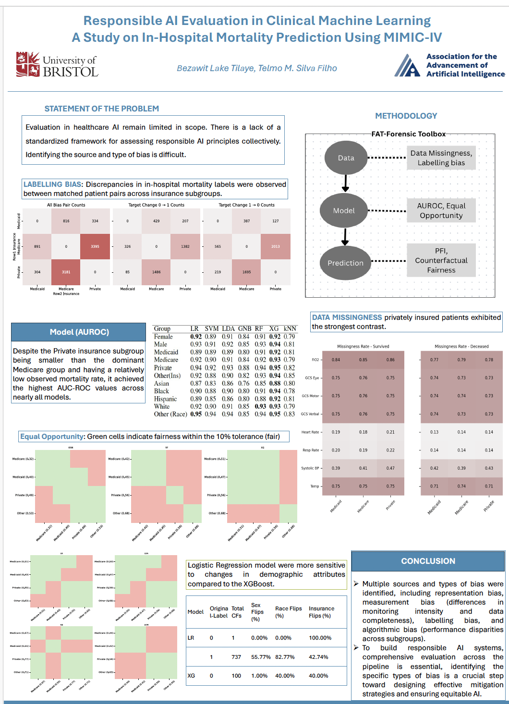

### Introduction
In January 2026, I had the opportunity to present my research at the AAAI-26 Conference on Artificial Intelligence in Singapore. My poster explored Responsible AI in healthcare, focusing on how fairness and transparency can be evalauted throughout the machine learning pipeline. Beyond presenting my work, the conference was a great opportunity to exchange ideas with researchers working across many areas of AI.

The project was motivated by a simple question:

> A machine learning model may achieve strong predictive performance, but does that necessarily mean it is responsible?

In healthcare, where AI systems have the potential to influence clinical decisions, predictive accuracy alone is not enough. Responsible AI also requires understanding how models learn from data, how they make predictions, and whether they behave consistently across different patient populations.

# Research Motivation

Machine learning has demonstrated significant potential in healthcare, supporting applications such as disease diagnosis, risk prediction, and personalised treatment planning. However, clinical datasets often reflect real-world differences in healthcare access, patient demographics, and data collection practices.

As a result, machine learning models may inherit biases present in the data. A model can achieve strong overall performance while still performing differently for particular patient groups. Understanding these differences is essential for building AI systems that clinicians and patients can trust.

# Evaluating Responsible AI Across the Pipeline

Many machine learning studies evaluate fairness only after a model has been trained, using predictive metrics such as AUROC alongside fairness measures. While these evaluations are valuable, they often provide limited insight into why disparities arise.

In this project, we instead examined fairness across the entire machine learning pipeline:

1. **Data level** : Investigating potential representation issues and biases within the dataset.
2. **Model level** : Evaluating predictive performance and fairness across multiple machine learning models.
3. **Prediction level** Analysing model outputs to identify differences in predictions across patient groups.

Using the MIMIC-IV critical care database, we developed and evaluated both linear and non-linear machine learning models. We also used the FAT Forensics toolkit to investigate fairness, accountability, and transparency throughout the modelling workflow.

{fig-alt="Presenting my research poster at AAAI 2026" fig-align="center"}

# What We Learned

One of the biggest lessons from this project was that responsible AI cannot be captured by a single evaluation metric.

A model's behaviour is shaped not only by its architecture but also by the characteristics of the data it learns from and the predictions it ultimately produces. Looking at these components together provides a much more complete understanding of model behaviour than evaluating predictive performance alone.

This work reinforced the value of developing evaluation frameworks that assess machine learning systems from multiple perspectives rather than relying on a single measure of performance.

# Presenting at AAAI 2026

Presenting this work at AAAI 2026 was a valuable experience. The discussions during the poster session introduced me to new perspectives on fairness evaluation, trustworthy AI, and the practical challenges of deploying machine learning in healthcare.

One of the most rewarding aspects of attending the conference was seeing how rapidly the Responsible AI community is evolving. Researchers from machine learning, healthcare, ethics, and policy are increasingly working together to develop AI systems that are not only accurate but also fair, transparent, and reliable.

# Looking Forward

This project has strengthened my interest in trustworthy and Responsible AI research. Going forward, I hope to continue developing methods for evaluating and improving AI systems throughout their lifecycle, particularly in high-impact domains such as healthcare.

Responsible AI is not only about building accurate models, it is about building systems that can be understood, evaluated, and trusted.