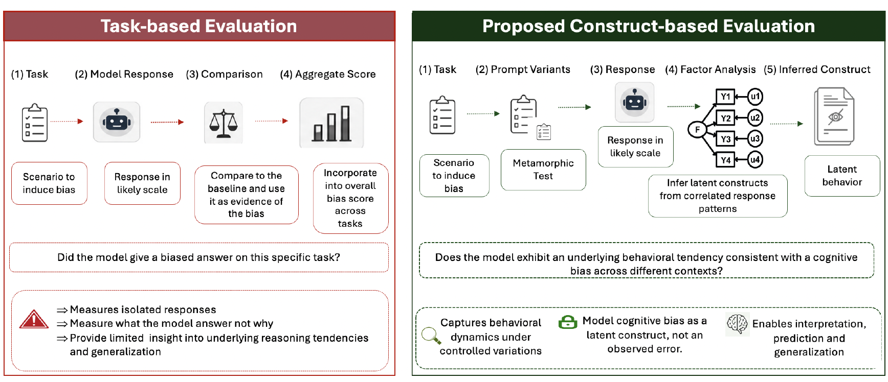

# Introduction

Large Language Models (LLMs) have rapidly become powerful tools for language understanding, reasoning, and decision support. As they are increasingly adopted in domains such as healthcare, education, finance, and public services, evaluating their behaviour has become just as important as evaluating their performance.

Most benchmark evaluations focus on what a model can do: answering questions, generating text, or solving reasoning tasks. While these benchmarks provide valuable insights, they reveal much less about how a model behaves when making decisions.

One important challenge is understanding whether LLMs exhibit forms of cognitive bias. Since these models are trained on large-scale human-generated data, they may capture and reproduce patterns present within human knowledge, behaviour, and communication.

However, evaluating cognitive bias in LLMs is challenging. Unlike traditional machine learning tasks where performance can be measured using clear metrics such as accuracy or AUROC, cognitive biases are often hidden characteristics that are not directly observable.

This raises an important question:

> How can we measure cognitive biases in AI systems when the biases themselves are latent?

In this work, we explored a psychometric-inspired approach to evaluating cognitive biases in LLMs, using structured prompts and factor analysis to investigate underlying patterns in model responses.

---

# Why Evaluate Cognitive Bias in LLMs?

LLMs are increasingly used as assistants for reasoning, decision-making, and information generation. However, if these systems contain systematic biases, they may influence the quality and fairness of their outputs.

Examples of cognitive biases that may influence decision-making include:

- Confirmation bias: favouring information that supports existing beliefs.
- Anchoring bias: relying too heavily on initial information.
- Availability bias: overestimating information that is easier to recall.
- Stereotyping bias: associating characteristics with groups based on learned patterns.

In psychology, researchers rarely observe these biases directly. Instead, they design carefully constructed experiments and infer hidden psychological characteristics from patterns in participants' responses.

This perspective motivated our approach:

> Rather than asking whether an LLM produces biased responses on average, can we identify hidden dimensions of bias behaviour?

---

# Why Average Bias Scores May Not Be Enough

Many existing approaches evaluate LLM bias by:

1. Creating prompts designed to test a specific bias.
2. Collecting model responses.
3. Calculating an average bias score.

For example, a model may receive multiple scenarios designed to test confirmation bias, and researchers may calculate how often the model demonstrates bias-consistent behaviour.

While useful, this approach has limitations.

A single average score may hide important variation in model behaviour. Two models could achieve the same overall score while demonstrating very different response patterns.

Additionally, cognitive biases are complex constructs. They may not appear independently, and several observed behaviours may reflect a smaller number of underlying factors.

This is where psychometric approaches provide an alternative perspective.

{fig-align="center"}

---

# Learning From Psychometrics: Measuring Hidden Constructs

Psychometrics is the field concerned with measuring psychological characteristics that cannot be directly observed.

Many important human characteristics are latent:

- Intelligence.
- Personality traits.
- Cognitive abilities.
- Attitudes.

One well-known example is the development of the **Big Five personality model**. Rather than measuring personality using a single question, psychologists analysed responses to many different questions and found that certain behaviours consistently clustered together. These clusters eventually became the five major personality dimensions.

This inspired our approach:

> If human psychological traits can be studied as latent factors, could cognitive biases in LLMs also be investigated as hidden dimensions?

---

# Our Approach: A Psychometric View of LLM Bias Evaluation

Our evaluation framework consisted of three main stages:

## 1. Selecting Cognitive Biases

We first identified cognitive biases that have established definitions within psychology.

For each bias, we designed evaluation scenarios intended to measure whether an LLM exhibited behaviour associated with that bias.

Examples include:

- Presenting conflicting information to examine confirmation bias.
- Providing initial information before a decision task to test anchoring effects.
- Creating availability-based scenarios to evaluate reliance on easily recalled information.

---

## 2. Designing Prompt-Based Measurement Items

Instead of using a single prompt per bias, we created multiple prompts representing different situations.

Each prompt acted similarly to a questionnaire item in psychometric evaluation.

The objective was not simply to measure whether one response was biased, but to examine whether consistent response patterns emerged across multiple scenarios.

This is important because individual responses may be influenced by randomness or prompt wording.

---

## 3. Applying Factor Analysis

The collected responses were analysed using factor analysis.

Factor analysis is a statistical technique used to identify underlying structures within observed variables.

In our context:

Observed variables:
- LLM responses to different bias-related prompts.

Latent factors:
- Underlying cognitive bias dimensions influencing those responses.

The goal was to understand whether groups of evaluation items represented common underlying patterns.

This provides a richer understanding than simply calculating average bias scores.

---

# Why Factor Analysis Matters for LLM Evaluation

Using factor analysis changes the question we ask.

Instead of:

> "How biased is this model?"

we ask:

> "What underlying patterns of bias-related behaviour does this model demonstrate?"

This shift is important because responsible AI evaluation requires understanding model behaviour, not only ranking models based on a single score.

A psychometric perspective may help identify:

- Whether biases consistently appear.
- Whether different biases are related.
- Whether models demonstrate similar behavioural patterns.
- Whether evaluation methods measure meaningful constructs.

---

# Implications for Responsible AI

As LLMs become increasingly integrated into decision-support systems, evaluation methods must evolve.

Traditional benchmark-based evaluation provides valuable information about capability, but responsible deployment requires deeper understanding of model behaviour.

Cognitive bias evaluation presents a particular challenge because biases are not directly observable. Approaches inspired by psychology and psychometrics provide a promising direction for studying these hidden characteristics.

Rather than treating bias evaluation as a simple scoring problem, we should consider methods that uncover the underlying behavioural patterns of AI systems.

---

# Future Directions

This work opens several research questions:

- Can psychometric frameworks provide reliable measures of LLM behaviour?
- Do different LLM architectures demonstrate different cognitive bias profiles?
- Can factor structures remain consistent across languages and domains?
- How can these evaluations support safer deployment of AI systems?

As AI systems become more capable, understanding their behaviour will become just as important as measuring their performance.

Responsible AI requires not only asking:

> "Can an AI system perform a task?"

but also:

> "How does the system reason, and what hidden patterns influence its behaviour?"